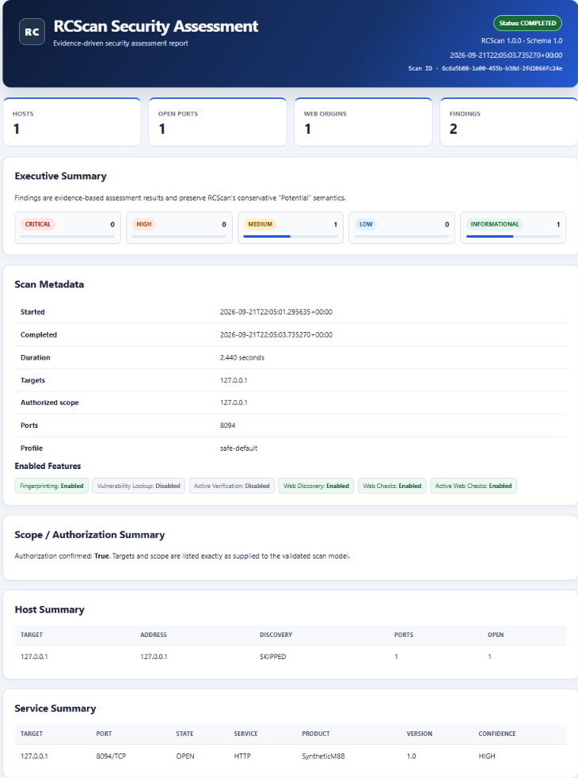
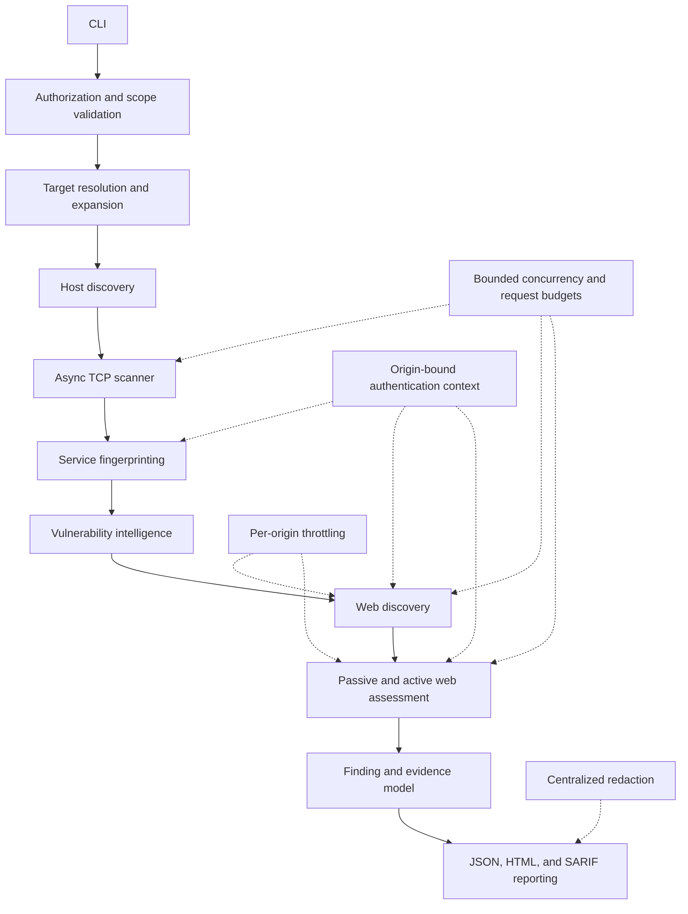
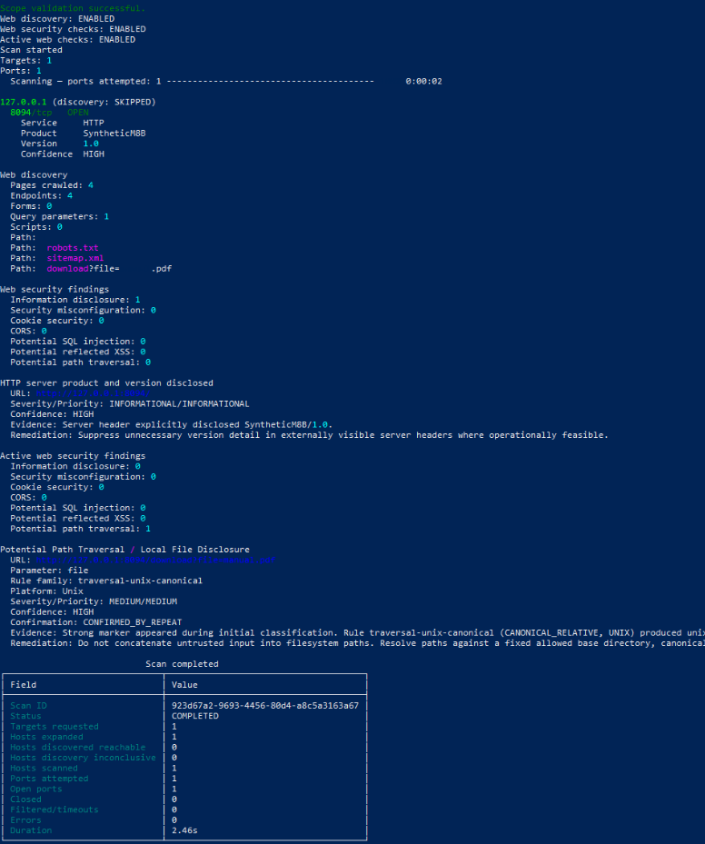
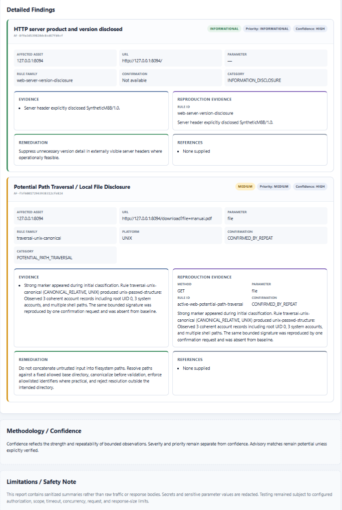
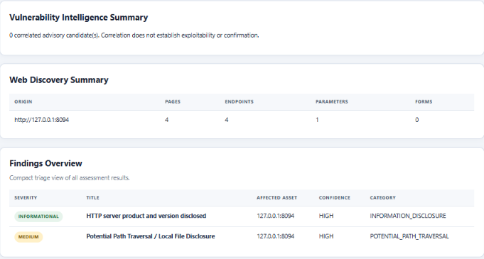

# RCScan

RCScan is an evidence-driven vulnerability assessment scanner built in Python for explicitly authorized security testing.

[](https://www.python.org/downloads/release/python-3120/)
[](LICENSE)
[](https://docs.astral.sh/ruff/)
[](https://mypy-lang.org/)

<!-- F6: add the GitHub Actions badge after the public repository URL is known.
[](https://github.com/OWNER/RCScan/actions/workflows/quality.yml)
-->

## Overview

RCScan helps an authorized operator turn a bounded network and web assessment into structured, reviewable evidence. It validates scope before connecting, identifies services from observed responses, and keeps vulnerability conclusions tied to the strength of that evidence.

It is professional-quality, cross-platform Python security tooling with production-oriented reporting. It is not a commercial enterprise scanner and does not claim parity with Nessus, Burp Suite, Acunetix, Invicti, or similar products.



*Standalone HTML report for an authorized localhost assessment.*

## Key capabilities

- Explicit authorization confirmation and strict scope enforcement
- Asynchronous TCP connect scanning and TCP host discovery
- Evidence-based HTTP, HTTPS, TLS, and SSH fingerprinting
- Conservative product/version and CVE correlation
- Bounded same-origin web discovery
- Passive web configuration checks
- Bounded active checks for SQL injection indicators, reflected XSS indicators, and path traversal / local-file disclosure indicators
- Static, origin-bound HTTP authentication context
- Shared per-origin throttling and bounded `Retry-After` handling
- JSON, standalone HTML, and SARIF 2.1.0 reports from one canonical model

## Architecture



Authorization and scope checks finish before target expansion, resolution, or any connection. Concurrency, timeouts, and request budgets stay in force across scanning and web assessment. Authentication values stay on the confirmed web origin. Reports are rendered after the scan from sanitized evidence, not from a second scan.

See [docs/architecture.md](docs/architecture.md) for the component map.

## Quick start

RCScan requires Python 3.12 or newer. It is not published on PyPI. Install from this source tree or from a built wheel.

### Windows PowerShell

```powershell
py -3.12 -m venv .venv
Set-ExecutionPolicy -Scope Process -ExecutionPolicy Bypass
.\.venv\Scripts\Activate.ps1
python -m pip install --upgrade pip
python -m pip install -e ".[dev]"
rcscan --version
rcscan --help
```

### Linux and macOS

```bash
python3.12 -m venv .venv
source .venv/bin/activate
python -m pip install --upgrade pip
python -m pip install -e ".[dev]"
rcscan --version
rcscan --help
```

### Built wheel

```text
pip install path/to/rcscan-1.0.0-py3-none-any.whl
```

Do not use `pip install rcscan` until a package is actually published.

## Example scan

Start a local HTTP service you control, then assess only that loopback target:

```text
rcscan scan \
  --target 127.0.0.1 \
  --scope 127.0.0.1 \
  --ports 8000 \
  --confirm-authorized \
  --allow-loopback \
  --skip-discovery
```

On Windows PowerShell, continue the command with backticks instead of backslashes.



*CLI output from a completed scan of 127.0.0.1.*

Useful options:

| Option | Purpose |
| --- | --- |
| `--confirm-authorized` | Attest permission for every in-scope target |
| `--scope` | Explicit authorized scope entry |
| `--ports` | Port preset, list, or range |
| `--allow-loopback` | Permit loopback targets for local testing |
| `--allow-public-targets` | Permit explicitly scoped public targets for this run |
| `--web-discovery` | Bounded same-origin web discovery |
| `--web-checks` | Passive web security checks |
| `--active-web-checks` | Bounded active GET checks |
| `--header` | Repeatable static HTTP header |
| `--cookie` | Repeatable static cookie |
| `--report-json` | Sanitized JSON report |
| `--report-html` | Standalone HTML report |
| `--report-sarif` | SARIF 2.1.0 report |
| `--verbose` | Safe diagnostic logging |

`--confirm-authorized` does not replace `--scope`, and `--allow-public-targets` does not bypass scope.

## Example finding

A controlled local path-traversal check can produce a review lead like this:

```text
Potential Path Traversal / Local File Disclosure
Severity: MEDIUM
Priority: MEDIUM
Confidence: HIGH
Parameter: file
Platform: Unix
Rule family: traversal-unix-canonical
Confirmation: CONFIRMED_BY_REPEAT
Evidence: A structured Unix account-file signature was absent from the baseline
response, appeared in the selected probe, and was reproduced by one bounded
confirmation request.
```

`CONFIRMED_BY_REPEAT` means the observed signal was reproduced by a bounded confirmation request. It does not mean arbitrary file access, exploitability, or compromise was proven. RCScan stores a marker description, not the contents of a disclosed file.



*Finding card with evidence, confirmation, and remediation. Confirmation reproduces the signal; it does not prove exploitability.*

## Supported assessment

**Safety and scope.** Authorization confirmation, exact scope containment, loopback and public-target opt-ins, and limits on targets, ports, pages, and requests. Web crawling stays on the authorized origin.

**Network.** Asynchronous TCP connect scanning, TCP host discovery, and `OPEN`, `CLOSED`, `FILTERED`, and `ERROR` classification, including Windows and POSIX socket handling, timeouts, retries, and bounded concurrency.

**Fingerprinting.** HTTP, HTTPS, TLS, and SSH identification from bounded evidence, including product/version extraction, non-standard ports, and TLS version/cipher metadata. A port number is only a probe hint.

**Vulnerability intelligence.** Conservative product normalization, CPE/CVE correlation, affected-version comparison, and explicit applicability states. Correlation does not prove exploitability.

**Web discovery.** Bounded same-origin crawling of links, forms, query parameters, selected resource URLs, `robots.txt`, and `sitemap.xml`.

**Passive web checks.** Information disclosure, security-header and configuration issues, cookie attributes, and observed CORS indicators.

**Active web checks.** Boolean-differential SQL injection indicators, reflected XSS indicators using an inert marker, and Unix/Windows path-traversal indicators. Strong results use repeat confirmation and reject weak signals such as a status or length change alone.

**Authentication and operations.** Repeatable custom headers, static cookies, origin-bound credentials, secret-safe logs and reports, shared per-origin throttling, `Retry-After` delay and HTTP-date handling, and bounded backoff.

**Reporting.** JSON, standalone HTML, and SARIF 2.1.0, all generated from one canonical report with centralized redaction.

Details live in the [documentation index](docs/index.md).

## Reporting

One completed scan can write all three formats without running again:

```text
rcscan scan ... \
  --report-json reports/scan.json \
  --report-html reports/scan.html \
  --report-sarif reports/scan.sarif
```

- **JSON** is deterministic, machine-readable output for automation.
- **HTML** is a self-contained, offline assessment deliverable.
- **SARIF 2.1.0** maps findings for code-scanning style ingestion. Remote results use URLs, not invented source line numbers.



*Findings overview and web discovery summary from the same canonical report.*

Reports explain why a finding exists. They redact authorization values, cookies, bearer tokens, and password-like parameters. They do not include raw response bodies or disclosed file contents. Each file is written through a temporary file and replaced atomically. A requested report that cannot be written fails explicitly.

See [docs/reporting.md](docs/reporting.md).

## Authenticated scanning

Supply credentials you already obtained. Do not put real tokens in documentation, screenshots, shell history that will be committed, or repository files.

```text
rcscan scan ... \
  --header "Authorization: Bearer <TOKEN>" \
  --cookie "session=<VALUE>"
```

The context is static and is attached only to the confirmed web origin. A redirect or resource on another scheme, host, or port does not receive it. RCScan v1.0 does not log in, attack credentials, or renew a session automatically.

See [docs/authenticated-scanning-and-throttling.md](docs/authenticated-scanning-and-throttling.md).

## Safety and authorization

- `--confirm-authorized` records the operator's attestation. It does not grant permission.
- Every target must still match the explicit scope.
- Loopback targets require `--allow-loopback` unless configuration already allows them.
- Public targets are blocked unless `--allow-public-targets` is set for that run, and scope still applies.
- Concurrency, timeouts, target counts, port counts, crawl limits, and active-request budgets are enforced.
- Web discovery and active checks stay on the authorized origin.
- Supplied credentials do not cross origins.
- HTTP 429 and eligible 503 responses use bounded `Retry-After` or backoff. Throttling never increases scan aggressiveness.
- Secrets are redacted from normal output, verbose diagnostics, and reports.
- RCScan does not perform WAF evasion, proxy or IP rotation, credential attacks, brute force, exploitation, or post-exploitation.

See [docs/scope-model.md](docs/scope-model.md) and [SECURITY.md](SECURITY.md).

## Detection philosophy

```text
Observation -> Evidence -> Classification -> Confirmation -> Confidence -> Finding
```

An open port does not identify a service. A port number can order probes, but only a bounded response can establish HTTP, HTTPS, TLS, or SSH. A product and version can support a CVE correlation, and that correlation remains potential applicability rather than proof of vulnerability. Reflected input is not executable XSS unless the relevant characters are reflected unescaped in an HTML context. Where the evidence does not justify a stronger claim, RCScan keeps wording such as "Potential".

## Testing and engineering quality

The current local baseline is 729 passing tests, with Ruff and mypy passing. Windows manual acceptance has passed for the frozen runtime. GitHub Actions is configured for Ubuntu, Windows, and macOS. Cross-platform CI is configured and will be verified during the final release gate.

Representative coverage includes authorization and scope boundaries, socket classification, Windows socket regressions, parsers, fingerprinting, TLS, crawling, active rules, false-positive controls, secret handling, authentication boundaries, throttling, reporting, packaging, and wheel/sdist installation.

## Controlled validation

Active web detection was manually exercised in explicitly authorized PortSwigger Web Security Academy training labs for SQL injection, reflected XSS, and path traversal. That is controlled training-environment validation. It is not an endorsement and does not prove universal coverage.

## Cross-platform support

RCScan is tested locally on Windows and configured for Ubuntu, Windows, and macOS CI on Python 3.12. Later Python versions are allowed by package metadata but are not part of the mandatory matrix.

## Project structure

```text
RCScan/
├── src/rcscan/
├── tests/
├── docs/
├── scripts/
├── config/
├── .github/workflows/
├── pyproject.toml
├── SECURITY.md
├── LICENSE
└── README.md
```

## Limitations

RCScan v1.0 is intentionally bounded:

- Targets are IPv4 addresses, IPv4 networks, and hostnames resolved to IPv4. IPv6 is rejected.
- There is no JavaScript or headless-browser execution, so single-page applications are not crawled dynamically.
- Web discovery reads static HTML, XML, and selected resource references.
- Authentication context is static. There is no automatic login or re-authentication.
- Active web checks cover a small reviewed set and use GET requests. They do not submit POST forms.
- Reflected XSS detection does not execute JavaScript in a browser.
- CVE correlation does not establish exploitability.
- There is no WAF bypass, proxy rotation, distributed scanning, or post-exploitation.

## Ethical use

Use RCScan only on systems you own or have explicit permission to assess. Authorization confirmation is an operator attestation, not a substitute for permission. Do not use this project for unauthorized access, disruption, evasion, credential attacks, or collection of data you are not permitted to access.

## Documentation

- [Documentation index](docs/index.md)
- [Architecture](docs/architecture.md)
- [Scope model](docs/scope-model.md)
- [Network scanning](docs/network-scanning.md)
- [Fingerprinting](docs/fingerprinting.md)
- [Vulnerability intelligence](docs/vulnerability-intelligence.md)
- [Findings and risk](docs/findings-and-risk.md)
- [Web discovery](docs/web-discovery.md)
- [Passive web checks](docs/web-security-checks.md)
- [Active web checks](docs/active-web-checks.md)
- [Active verification](docs/active-verification.md)
- [Reporting](docs/reporting.md)
- [Authenticated scanning and throttling](docs/authenticated-scanning-and-throttling.md)
- [Development and packaging](docs/development.md)
- [Security policy](SECURITY.md)

## License

RCScan is released under the [MIT License](LICENSE).
